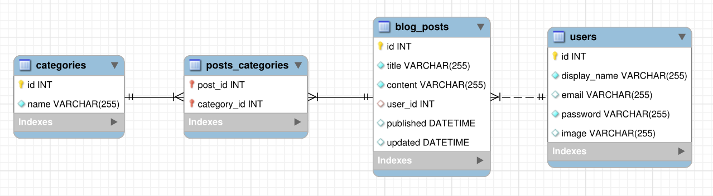

# Blog API - Uma plataforma para produção de conteúdo! 🚀

## Desenvolvedor
**Nome**: Gabriel Cabral Melo <br>
**GitHub**: [gabecmelo](https://github.com/gabecmelo) <br>
**LinkedIn**: [Gabriel Cabral Melo](https://www.linkedin.com/in/gabrielc-melo/)

## Sobre a Aplicação
Este projeto consiste em uma API Restful para a produção de conteúdo em um blog. A aplicação oferece endpoints para listar, cadastrar, atualizar e deletar posts, usuários e categorias. Além disso, possui funcionalidades como login de usuários e busca de posts por termos específicos.

## Estrutura do Projeto
O projeto segue uma arquitetura em camadas, facilitando o desenvolvimento e manutenção. As principais camadas são: models, controllers, services e routes. O ORM Sequelize é utilizado para interação com o banco de dados, seguindo o formato das entidades do Diagrama de Entidade-Relacionamento.

## Pré-requisitos
**Node.js** *16.14 ou superior* <br>
**Docker e Docker Compose** *para a execução dos contêineres*

## Como Iniciar a Aplicação

### Opção 1: Docker Compose
Instale as dependências: `npm install` <br>

Inicie os containers com: `docker-compose up -d --build` *(isso inicializará um container para a API e outro para o banco de dados)* <br>

Acesse a aplicação em: `http://localhost:<API_PORT>` no navegador ou no client de sua escolha *(ex: Thunder Client, Postman, Insomnia...)*

> ⚠️ Atenção: A aplicação deverá receber variáveis de ambiente como exemplificado em [`env.example`](./env.example) para poder se comunicar com o serviço de banco de dados, além de variáveis como porta para acesso local.

## Comandos dos Testes:

```bash
#### Comandos dos testes do avaliador
npm run lint          # Verificação do linter
npm test              # Roda todos os testes no terminal
npm test 01       # Substitua 01 pelo teste de sua escolha
npm run cy:open       # Abre a interface gráfica do Cypress para testes
```

## Tabelas do Banco de Dados

|Diagrama de Entidade-Relacionamento|
|:--:|
||

#### Formato das entidades

  O seu projeto utiliza o `ORM Sequelize` para criar e atualizar o seu banco de dados. 

  - Uma tabela chamada **users**, contendo dados com a seguinte estrutura:

    | id  | display_name    | email           | password | image                                                                                   |
    | --- | --------------- | --------------- | -------- | --------------------------------------------------------------------------------------- |
    | 1   | Brett Wiltshire | brett@email.com // tem quer ser único | 123456   | http://4.bp.blogspot.com/_YA50adQ-7vQ/S1gfR_6ufpI/AAAAAAAAAAk/1ErJGgRWZDg/S45/brett.png |

  - Uma tabela chamada **categories**, contendo dados com a seguinte estrutura:

    | id  | name |
    | --- | ---- |
    | 18  | News |

  - Uma tabela chamada **blog_posts**, contendo dados com a seguinte estrutura:

    | id  | title                      | content                                                | user_id | published                | updated                  |
    | --- | -------------------------- | ------------------------------------------------------ | ------- | ------------------------ | ------------------------ |
    | 21  | Latest updates, August 1st | The whole text for the blog post goes here in this key | 14  // Chave estrangeira, referenciando o id de `users`    | 2011-08-01T19:58:00.000Z | 2011-08-01T19:58:51.947Z |


  - Uma tabela chamada **PostCategories**, contendo uma **chave primária composta** utilizando os dois atributos da estrutura:

    | post_id | category_id |
    | ------- | ----------- |
    | 50 // Chave primária e estrangeira, referenciando o id de `BlogPosts`     | 20  // Chave primária e estrangeira, referenciando o id de `Categories`     |


    *Os dados acima são fictícios, e estão aqui apenas como exemplo*

    ---

    #### Dicas de scripts prontos

    - Deleta o banco de dados:
    ```json
    "drop": "npx sequelize-cli db:drop"
    ```

    - Cria o banco e gera as tabelas:
    ```json
    "prestart": "npx sequelize-cli db:create && npx sequelize-cli db:migrate"
    ```

    - Insere dados/Popula a tabela:
    ```json
    "seed": "npx sequelize-cli db:seed:all"
    ```

## Rotas da Aplicação
A aplicação possui diversas rotas para interagir com produtos e suas respectivas vendas.

*Cadastro de Usuários:* **POST /user** <br>

*Autenticação de Usuários:* **POST /login**<br>

> ⚠️ Atenção: A partir daqui, a aplicação irá gerar um bearer token com jwt, que deverá ser utilizado no header (cabeçalho), no seguinte formato: **Bearer tokenHeader.tokenPayload.tokenSignature**. <br>- Consulte a documentação do [`jwt`](https://jwt.io/) para mais detalhes.

*Listagem de Usuários:* **GET /user** e **GET /user/:id** <br>

*Listagem de Categorias:* **GET /categories** <br>

*Cadastro de Categorias:* **POST /categories** <br>

*Listagem de Posts:* **GET /post** e **GET /post/:id** <br>

*Cadastro de Posts:* **POST /post** <br>

*Atualização de Posts:* **PUT /post/:id** <br>

*Deleção de Posts:* **DELETE /post/:id** <br>

*Deleção de Usuários:* **DELETE `/user/me** <br>

*Busca de Posts por Termo:* **GET /post/search?q=termo** *<- Substitua **termo** pela busca desejada* <br>

## ***Aproveite o Projeto Store Manager! 🚀***

## Feedbacks e Contribuições:

Sinta-se à vontade para fornecer feedbacks sobre o projeto. Contribuições são bem-vindas!

Se deseja contribuir, faça um fork do repositório, implemente suas modificações e abra um Pull Request. Aguardo suas contribuições!

Este projeto é baseado em requisitos da Trybe, adaptando e personalizando conforme necessário.